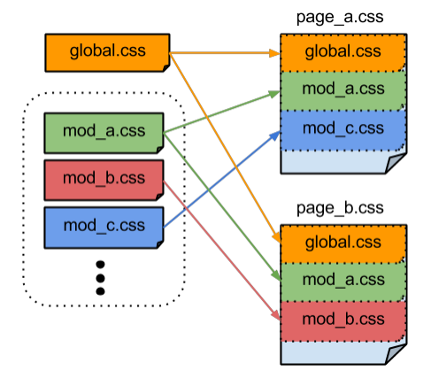
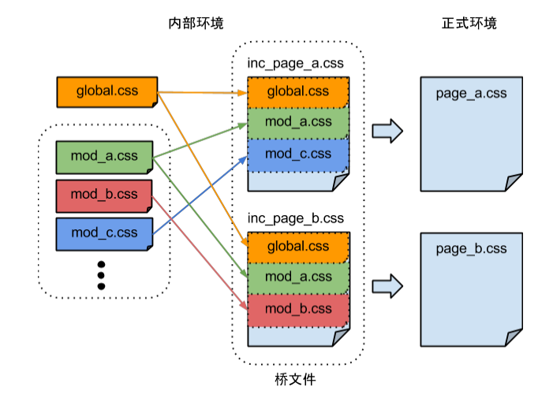

# 前端开发规范

## 理解表现和结构相分离
先看一张图

### 内容 
内容就是页面实际要传达的真正信息，包含数据、文档或者图片等。注意这里强调的“真正”，是指纯粹的数据信息本身。比如一个不包含辅助的信息,比如装饰性图片等。
### 结构
一些html标签，用正确的标签包裹正确的内容；比如标题用h1~h6、列表用 ul,li，强调用strong,em等
### 表现
虽然定义了结构，但是内容还是原来的外观没有改变，例如标题字体没有变大，正文的颜色也没有变化，没有背景，没有修饰。所有这些用来改变内容外观的东西，我们称之为“表现”。
### 行为
行为就是对内容的交互及操作效果。例如，我们最熟悉不过的JavaScript。使用JavaScript我们可以使内容动起来，可以判断一些表单提交，可以相应你的一些操作。

## HTML规范

###基本原则
* 编写html结构，要语义话，内容与结构分离。
* 段落分隔符要使用实际对应的`
`元素，而不是用多个` `标签。
* 在合适的条件下，充分利用`<dl>` （定义列表）和`<blockquote>` 标签。
* 列表中的条目必须总是放置于`<ul>`、`<ol>`或`<dl>` 中，永远不要用一组 `
`或`
` 来表示。
* 给每个表单里的字段加上 `<label>` 标签，其中的 `for `属性必须和对应的输入字段对应，这样用户就可以点击标签。同理，给标签加上 `cursor:pointer`; 样式也是明智的做法。
* 不用使用输入字段中的 `size` 属性。该属性是和输入字段里文本的 `font-size` 相关的。应该使用CSS宽度。
* 在某些闭合的 `
` 标签旁边加上一段html注释，说明这里闭合的是什么元素。这在有大量嵌套和缩进的情况下会很有用。
* 不要把表格用于页面布局。
* 在合适的条件下，利用 `<thead>`、`<tbody>`和`<th>`标签。
### Doctype
标记中必须总是使用合适的Doctype来指示浏览器触发标准模式. 永远要避免Quirks模式。

HTML5特别好的一个方面就是它简化了Doctype需要的代码。无意义的属性被弃用了，DOCTYPE 声明也被显著地简化了。另外，也无需再用 CDATA 对内联JavaScript代码进行转义，而这在此之前为了让XHTML符合XML的严密性是必需的。

        <!DOCTYPE html>

###字符编码
所有标记必须通过UTF-8编码传递，因为这种编码方式是对国际化最友好的。必须在HTTP的header和HTML文档的head部分都指定这种编码。

设定字符编码是通过 <meta> 标签进行。

    <meta http-equiv="Content-Type" content="text/html; charset=UTF-8" />

###属性加引号
在HTML5规范里并没有严格要求属性值两边加引号。但考虑到一些属性可以接受空白值，为了保持一致性，我们要求所有属性值必须加上引号。

    
This is my paragraph of special text.

## CSS
###基本原则
* 从外部文件加载CSS，尽可能减少文件数。加载标签必须放在文件的 HEAD 部分。
* 用 LINK 标签加载，永远不要用@impor。加载样式表
* 不要在文件中用内联式引入的样式，不管它是定义在样式标签里还是直接定义在元素上。这样会很难追踪样式规则。
* 使用 normalize.css 让渲染效果在不同浏览器中更一致。
* 理解 层叠和选择器的明确度 ，这样你就可以写出非常简洁且高效的代码。
* 编写性能优化的选择器。尽可能避免使用开销大的CSS选择器。例如，避免 * 通配符选择器，也不要叠加限定条件到 ID 选择器（例如 div#myid）或 class 选择器（例如 table.results）上。这对于速度至上并包含了成千上万个DOM元素的web应用来说尤为重要。
* 选择器单独占一行，每个属性占一行。属性声明要有缩进。
* **模块化方式开发css**

###样式命名规则 
> 命名原则 无入侵式命名， 与bootstrap命名靠拢  

**基类命名**
`模块名+[模块编号]`    
* 模块名：模块名称。 
* 编号：模块的编号，用于区分同类模块。当只有一个版本时不需要写模块编号，即基类命名中 模块编号一定是大于“1”的。 
例： .tab{} .tab-2{} 

**扩展类命名**
`模块名+[模块编号]+扩张类`  
* 扩张类型：比如模块状态,或者作用；用于对类型的补充。 
例： .tab-active{}

**实例类命名**
`模块名+[模块编号]+[扩张类]+[位置|区域|名称]`    
* 位置：定义类所使用的位置，如首页、导航等等，不排除使用左、右这样的词，但应尽量避 免。
例： .tab-index{}

### CSS样式属性义类型 
CSS样式的属性义有很多，像手册上就分为“字体”、“文本”、“背景”、“定位”等等17种，在实 际工作中，并不需要分得这么的细，常用的属性大致可以分为以下两类： 

**表现属性**   
与颜色、字体、图片相关的属性     
如： color:#FF00FF; font-size:12px; background-color:#FF00FF; background:#FF00FF url(demo.img) top left;   
这类属性一般用于皮肤的定义    
**布局属性** 
与位置、大小相关的属性    
如： width:100px; position:relative; top:10px;  

###样式注释 
由于样式命名上已经做到了模块的自解释，所以注释这部分已经没有太多的内容需要写上了。    
例子   

            /** mode ** 
            @author:作者名  
            @note:模块说明文本 \n 
            模块注释内所有内容都以关键字开始，换行结束 \n  
            如需换行:可添加 “\n” \n 也可以连着写，但如果换行书写时，必需作为结尾。不能有空行。 @demo:\ref{说明文本:URL} 
            @html: 
            <!-- HTML结构 --> 
            
 
                
...
 
                
...
 
            

             @endhtml 
             */ 
            .mod-tab-1{} 
            .mod-tab-1 .tab-title{} 
            .mod-tab-1 .tab-cont .title{} 
            .mod-tab-1 .tab-cont .cont{} 
            .mod-tab-1 .tab-cont .op{} 

### 模块管理的问题 
当你的模块越来越多之后，模块的管理问题就会随之而来。公共文件越来越大，一些使用不上 的模块也因为放在公共文件中而被不断的重复加载，造成带宽的浪费。聪明的你一定想到了， 把模块拆出来，按需加载：  

如上图，每一个模块分别拆成独立的文件，然后通过引用外部文件的方式链接到当前页面的样 式文件里，从而实现按需加载。然而，这样会引发另一个问题，链接数的增加。一个页面有多 少个模块，就会增加多少个链接，显然不是我们所希望的。    
我们都知道，解决链接数过多的方法很简单，就是把它们合并就行了。那么，我们同时需要解 决合并后所可能带来的问题——怎么更新的问题。

使用“桥文件”解决文件更新问题 

### 使用“桥文件”解决文件更新问题 
   
借助grunt自动化合并文件

### 用less加快css开发
less是一款css预处理工具，增加了设置变量（variables）、引用（mixins）、嵌套（nested）、运算（operations）的功能。  

less的主要好处有三个
* 颜色 样式统一定义
* HTML/CSS 语义/样式 分离
* 提升开发效率

##js

###基本原则
* 99%的代码必须封装在外部Javascript文件中。这些文件必须在 BODY 标签的尾部引入，让页面的性能最大化。
* 使用空格代替tab缩进。
* 减少全局变量。
* 使用标准的文档注释。
  /**
   * [function description]
   * @param  {[type]} params [description]
   * @return {[type]}        [description]
   */
* 使用规范有意义的变量名
* 一个函数应该返回统一的数据类型
* 不在文件中留下未来确定不再使用的代码片段
* 保证代码压缩后不出错。

###js模块化

一个模块就是实现特定功能的文件，有了模块，我们就可以更方便地使用别人的代码，想要什么功能，就加载什么模块。模块开发需要遵循一定的规范，否则就都乱套了。

根据AMD规范，我们可以使用define定义模块，使用require调用模块。

目前，通行的js模块规范主要有两种：CMD和AMD。

#### AMD规范
定义一个模块

      
    define('dialog', ['jquery'], function(){
      function dialog() {
        ...
        return {
            open : function(params){
                alert(params);
            }
        }
      };    
      return dialog    
    })
    

引用模块
    
    require(['dialog'], function(dialog){
      dialog.open('ddd');
      // 业务逻辑
    })

**模块化优点**
* 可维护性 
* 灵活架构，焦点分离 
* 方便模块间组合、分解 
* 方便单个模块功能调试、升级 
* 多人协作互不干扰
* 按需加载

